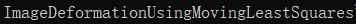
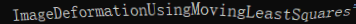
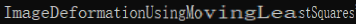
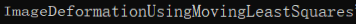

# pybind11-Scene-Text-Image-Transformation

## Contributions

Codes borrows from

- [Canjie-Luo/Scene-Text-Image-Transformer](https://github.com/Canjie-Luo/Scene-Text-Image-Transformer)

- [cxcxcxcx/imgwarp-opencv](https://github.com/cxcxcxcx/imgwarp-opencv)

- [yati-sagade/opencv-ndarray-conversion](https://github.com/yati-sagade/opencv-ndarray-conversion)

- [edmBernard/pybind11_opencv_numpy](https://github.com/edmBernard/pybind11_opencv_numpy)

- [cv_mat_to_numpy](https://www.jianshu.com/p/be16847b0b74)

A tool for scene text data augmentation. provided the tool to avoid overfitting and gain robustness of models.

## Requirements

- [GCC](https://gcc.gnu.org/gcc-4.8/) 4.8.*
- [Python](https://www.python.org/) 3.5.*
- [OpenCV](https://opencv.org/) 2.4.*
- [PyBind11](https://github.com/pybind/pybind11)

## Installation

- install OpenCV and python3 on ubuntu 16.04

- try docker **Recommend✔**

```bash
docker push allenzhou1996/mls-pybind11:latest
```

Build project:

```bash
./build.sh
```

```bash
python test_mls_pybind11.py
```

## Demo

- Original Image



- Distortion

 

- Stretch



- Perspective



## Speed

To transform an [demo image](pic/demo.png) with size (H:101, W:842), it takes less than **2.4ms (0.0024 sec)** using a i5-8400 @2.8GHz CPU. 


## Citation

```
@inproceedings{schaefer2006image,
  title={Image deformation using moving least squares},
  author={Schaefer, Scott and McPhail, Travis and Warren, Joe},
  booktitle={ACM transactions on graphics (TOG)},
  volume={25},
  number={3},
  pages={533--540},
  year={2006},
  organization={ACM}
}
```
