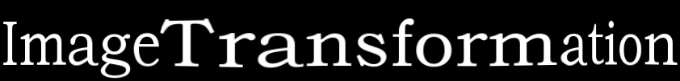

# pybind11-Scene-Text-Image-Transformation

Thanks for [Canjie-Luo](https://github.com/Canjie-Luo), codes borrows from [Canjie-Luo/Scene-Text-Image-Transformer](https://github.com/Canjie-Luo/Scene-Text-Image-Transformer)

A tool for scene text data augmentation. provided the tool to avoid overfitting and gain robustness of models.

## Requirements

- [GCC](https://gcc.gnu.org/gcc-4.8/) 4.8.*
- [Python](https://www.python.org/) 3.5.*
- [OpenCV](https://opencv.org/) 2.4.*
- [PyBind11](https://github.com/pybind/pybind11)

## Installation

- install OpenCV on ubuntu 16.04

```bash
./install-opencv.sh
```

- try docker

```bash
docker push allenzhou1996/mls-pybind11:latest
```

Build project:

```bash
./build.sh
```

```bash
python test_mls_pybind11.py
```

## Demo

- Distortion

 

- Stretch



- Perspective


## Speed

To transform an [image](pic/demo.png) with size (H:101, W:842), it takes less than **2.4ms (0.0024 sec)** using a i5-8400 @2.8GHz CPU. 

## Improvement for Recognition

We compare the accuracies of [CRNN](https://github.com/meijieru/crnn.pytorch) trained using only the corresponding small training set.

| <center>Dataset</center> | <center>IIIT5K</center> | <center>IC13</center> | <center>IC15</center> |
| :---: | :---: | :---: | :---:|
| Without Data Augmentation | <center>40.8%</center> | <center>6.8%</center> | <center>8.7%</center> |
| <center>With Data Augmentation</center> | <center>53.4%</center> | <center>9.6%</center> | <center>24.9%</center> | 


## Citation

```
@inproceedings{schaefer2006image,
  title={Image deformation using moving least squares},
  author={Schaefer, Scott and McPhail, Travis and Warren, Joe},
  booktitle={ACM transactions on graphics (TOG)},
  volume={25},
  number={3},
  pages={533--540},
  year={2006},
  organization={ACM}
}
```

## Acknowledgment
The tool is the combination of [@cxcxcxcx's](https://github.com/cxcxcxcx) [imgwarp-opencv](https://github.com/cxcxcxcx/imgwarp-opencv) and [@Yati Sagade's](https://github.com/yati-sagade) [opencv-ndarray-conversion](https://github.com/yati-sagade/opencv-ndarray-conversion). Thanks for your contribution. 

## Attention
The tool is only free for academic research purposes.
